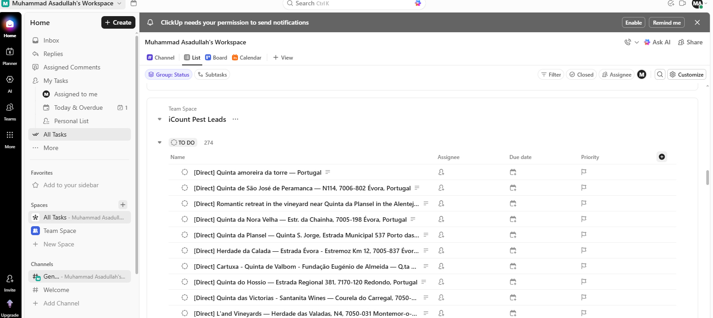
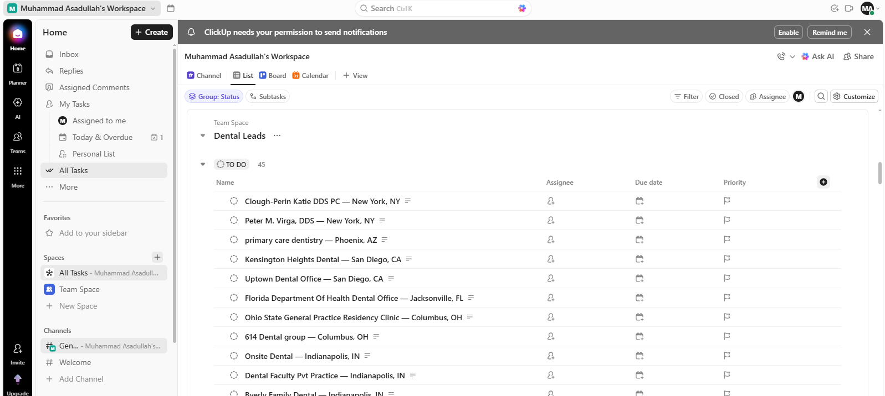
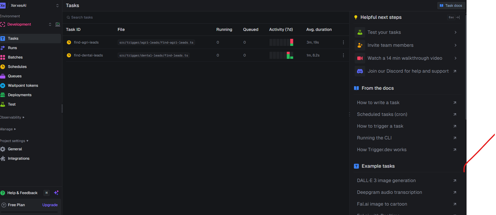
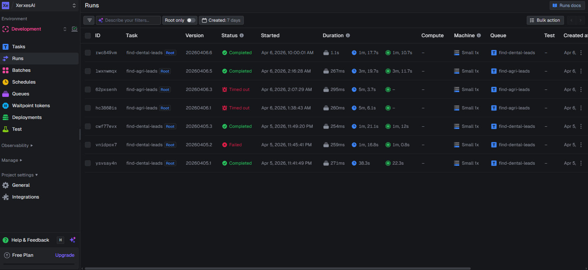
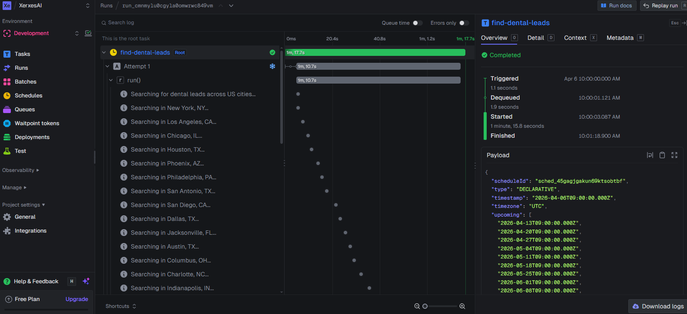
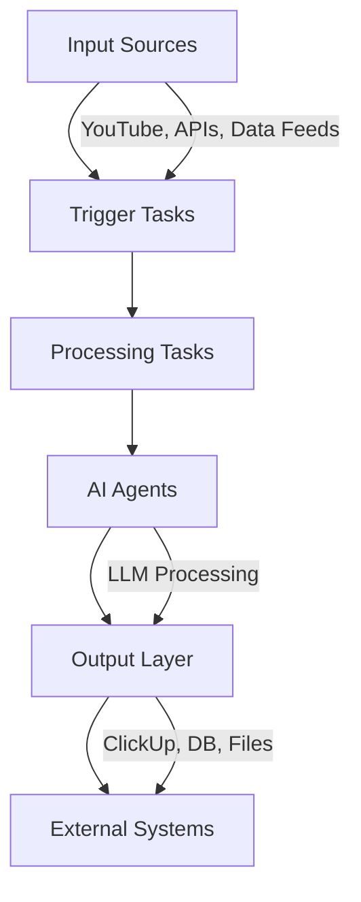
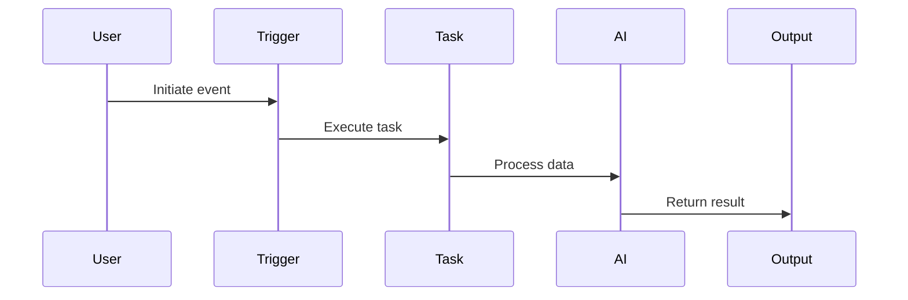

# AI Workflow Automation Engine

Build intelligent automation systems powered by AI.

---

## Screenshots

### ClickUp - Agile Leads


### ClickUp - Dental Leads


### Trigger.dev - Both Workflows


### Trigger.dev - All Processes


### Trigger.dev - Dental Lead Generation


---

## Overview

AI Workflow Automation Engine is a modular, event-driven automation system built with Trigger.dev and TypeScript. It enables developers to create scalable automation pipelines powered by AI agents for processing data, monitoring sources, and executing workflows.

---

## Architecture



---

## Features

- Event-driven and scheduled workflows
- Modular task-based architecture
- AI-powered data processing
- Integration with external APIs
- Scalable automation pipelines

---

## Tech Stack

- TypeScript
- Trigger.dev
- Node.js
- AI APIs (LLMs)
- REST APIs

---

## Project Structure

```
src/
  trigger/
    ai-news-digest/
    company-research/
    video-processing/
```

---

## Getting Started

### 1. Install dependencies

```bash
npm install
```

### 2. Run development server

```bash
npx trigger.dev@latest dev
```

### 3. Configure environment variables

Create a `.env` file and add required API keys.

---

## Usage

Define tasks using Trigger.dev SDK and connect them into workflows.

---

## Example Workflow



---

## Roadmap

- Add multi-agent orchestration
- Integrate real-time data pipelines
- Build dashboard interface
- Expand AI capabilities

---

## License

MIT
